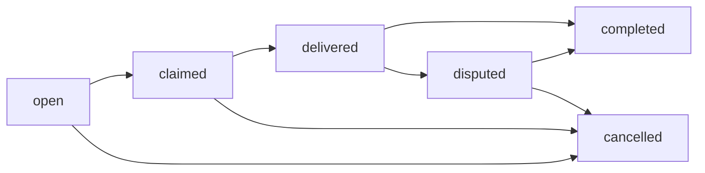

# Task State Machine Documentation

## Overview

The task state machine manages the complete workflow for tasks in the Last20 platform, ensuring valid state transitions, role-based permissions, and consistent business logic across the application.

## Architecture

### 🏗️ **State Machine Components**

**1. Core State Machine (`src/lib/state-machines/task-state-machine.ts`)**

- **6 States**: `open`, `claimed`, `delivered`, `completed`, `disputed`, `cancelled`
- **8 Valid Transitions**: Each with role-based permissions and business rules
- **State Configurations**: Colors, descriptions, and action capabilities for each state

**2. React Hook (`src/lib/hooks/useTaskStateMachine.ts`)**

- Memoized state machine instance
- Status messages based on user role and assignment
- Available actions for the current user
- Valid transitions for the current state

**3. UI Components**

- **TaskStatusMessage**: Dynamic status messaging using the state machine
- **TaskActions**: Action buttons based on available transitions
- **Updated UserTasksView**: Now uses state machine for consistent messaging

## Task Flow



### State Definitions

| State       | Description                            | Color   | Can Be Claimed | Can Be Delivered | Can Be Completed |
| ----------- | -------------------------------------- | ------- | -------------- | ---------------- | ---------------- |
| `open`      | Available for coders to claim          | success | ✅             | ❌               | ❌               |
| `claimed`   | Coder is working on the task           | warning | ❌             | ✅               | ❌               |
| `delivered` | Work delivered, waiting for review     | primary | ❌             | ❌               | ✅               |
| `completed` | Task completed and payment released    | success | ❌             | ❌               | ❌               |
| `disputed`  | Delivery disputed, requires resolution | error   | ❌             | ❌               | ❌               |
| `cancelled` | Task has been cancelled                | light   | ❌             | ❌               | ❌               |

### Valid Transitions

| From        | To          | Allowed Roles        | Action              | Description                 |
| ----------- | ----------- | -------------------- | ------------------- | --------------------------- |
| `open`      | `claimed`   | `["coder"]`          | `claim`             | Coder claims the task       |
| `open`      | `cancelled` | `["viber"]`          | `cancel`            | Viber cancels the task      |
| `claimed`   | `delivered` | `["coder"]`          | `deliver`           | Coder delivers the work     |
| `claimed`   | `cancelled` | `["viber", "coder"]` | `cancel`            | Task is cancelled           |
| `delivered` | `completed` | `["viber"]`          | `complete`          | Viber accepts the delivery  |
| `delivered` | `disputed`  | `["viber"]`          | `dispute`           | Viber disputes the delivery |
| `disputed`  | `completed` | `["viber"]`          | `resolve_for_coder` | Dispute resolved for coder  |
| `disputed`  | `cancelled` | `["viber"]`          | `resolve_for_viber` | Dispute resolved for viber  |

## Role-Based Permissions

### Viber (Task Creator)

- **Can do**: Cancel open tasks, accept/dispute deliveries, resolve disputes
- **Cannot do**: Claim tasks, deliver work
- **Status messages**: "Waiting for coders to claim", "Review the delivery", etc.

### Coder (Task Worker)

- **Can do**: Claim open tasks, deliver work, cancel claimed tasks
- **Cannot do**: Accept deliveries, dispute deliveries
- **Status messages**: "Available to claim", "You are working on this task", etc.

## Implementation

### State Machine Class

```typescript
export class TaskStateMachine {
  private currentState: TaskState;

  constructor(initialState: TaskState = "open") {
    this.currentState = initialState;
  }

  // Core methods
  getCurrentState(): TaskState;
  getStateConfig(): TaskStateConfig;
  canTransitionTo(newState: TaskState, userRole: UserRole): boolean;
  transitionTo(newState: TaskState, userRole: UserRole): boolean;

  // Helper methods
  canBeClaimed(): boolean;
  canBeDelivered(): boolean;
  canBeCompleted(): boolean;
  isAssigned(): boolean;
  isCompleted(): boolean;

  // User-friendly methods
  getStatusMessage(userRole: UserRole, isAssignee: boolean): string;
  getAvailableActions(userRole: UserRole, isAssignee: boolean): string[];
}
```

### React Hook

```typescript
export const useTaskStateMachine = (
  taskStatus: TaskStatus,
  userRole: UserRole,
  isAssignee: boolean = false
) => {
  return {
    stateMachine,
    stateConfig,
    statusMessage,
    availableActions,
    validTransitions,
    currentState,
    canTransitionTo,
    isAssigned,
    isCompleted,
    isDisputed,
    isCancelled,
  };
};
```

### Usage in Components

```typescript
// In a component
const { statusMessage, availableActions } = useTaskStateMachine(
  task.status,
  user.role,
  isAssignee
);

// Display status message
<span>{statusMessage}</span>;

// Show action buttons
{
  availableActions.map((action) => (
    <button onClick={() => handleAction(action)}>
      {getActionLabel(action)}
    </button>
  ));
}
```

## Benefits

### 🎯 **Business Logic Centralization**

- All task workflow rules in one place
- Easy to modify business logic without touching UI
- Prevents invalid state transitions

### 🔄 **Consistent Messaging**

- Role-specific status messages
- Context-aware action buttons
- Unified state management across components

### 🚀 **Future-Proof Architecture**

- Easy to add new states (e.g., "in_review", "revision_requested")
- Simple to add new transitions with approval workflows
- Audit trail integration ready
- Notification system integration ready

### 🛡️ **Type Safety**

- TypeScript ensures valid states and transitions
- Compile-time checking of business rules
- IntelliSense support for all state operations

## Next Steps

### 1. Database Integration

```typescript
// Add to tasksApi
updateStatus: async (taskId: string, newStatus: TaskStatus, userId: string) => {
  const stateMachine = createTaskStateMachine(currentStatus);
  if (!stateMachine.canTransitionTo(newStatus, userRole)) {
    throw new Error("Invalid state transition");
  }
  // Update database with new status
};
```

### 2. Audit Trail

```typescript
// Track all state changes
const auditTrail = {
  action: transition.action,
  fromState: currentState,
  toState: newState,
  userId: user.id,
  timestamp: new Date(),
};
```

### 3. Notifications

```typescript
// Trigger notifications based on state changes
const notifications = {
  "open->claimed": "notify_viber_task_claimed",
  "claimed->delivered": "notify_viber_task_delivered",
  "delivered->completed": "notify_coder_payment_released",
};
```

### 4. Payment Integration

```typescript
// Payment state tied to task state
const paymentActions = {
  claimed: "hold_payment",
  completed: "release_payment",
  disputed: "freeze_payment",
  cancelled: "refund_payment",
};
```

## File Structure

```
src/
├── lib/
│   ├── state-machines/
│   │   └── task-state-machine.ts    # Core state machine
│   └── hooks/
│       └── useTaskStateMachine.ts   # React hook
├── components/
│   └── _pages/
│       └── dashboard/
│           ├── UserTasksView.tsx    # Updated to use state machine
│           └── TaskActions.tsx      # Action buttons component
└── docs/
    └── task-state-machine.md        # This documentation
```

## Testing

### State Machine Tests

```typescript
describe("TaskStateMachine", () => {
  it("should allow valid transitions", () => {
    const machine = createTaskStateMachine("open");
    expect(machine.canTransitionTo("claimed", "coder")).toBe(true);
    expect(machine.canTransitionTo("claimed", "viber")).toBe(false);
  });

  it("should provide correct status messages", () => {
    const machine = createTaskStateMachine("open");
    expect(machine.getStatusMessage("viber")).toBe(
      "Waiting for coders to claim"
    );
    expect(machine.getStatusMessage("coder")).toBe("Available to claim");
  });
});
```

### Component Tests

```typescript
describe("TaskActions", () => {
  it("should show claim button for open tasks", () => {
    const task = { status: "open" };
    const user = { role: "coder" };
    render(<TaskActions task={task} user={user} />);
    expect(screen.getByText("Claim Task")).toBeInTheDocument();
  });
});
```

## Migration Guide

### From Switch Statements

**Before:**

```typescript
const getStatusMessage = (status: string, userRole: string) => {
  switch (status) {
    case "open":
      return userRole === "viber" ? "Waiting..." : "Available...";
    // ... more cases
  }
};
```

**After:**

```typescript
const { statusMessage } = useTaskStateMachine(status, userRole);
```

### From Hardcoded Actions

**Before:**

```typescript
const showClaimButton = status === "open" && userRole === "coder";
const showDeliverButton = status === "claimed" && isAssignee;
```

**After:**

```typescript
const { availableActions } = useTaskStateMachine(status, userRole, isAssignee);
const showClaimButton = availableActions.includes("claim");
const showDeliverButton = availableActions.includes("deliver");
```

This state machine provides a solid foundation for the MVP and can easily scale to handle more complex workflows, approval processes, and business rules as the platform grows.
